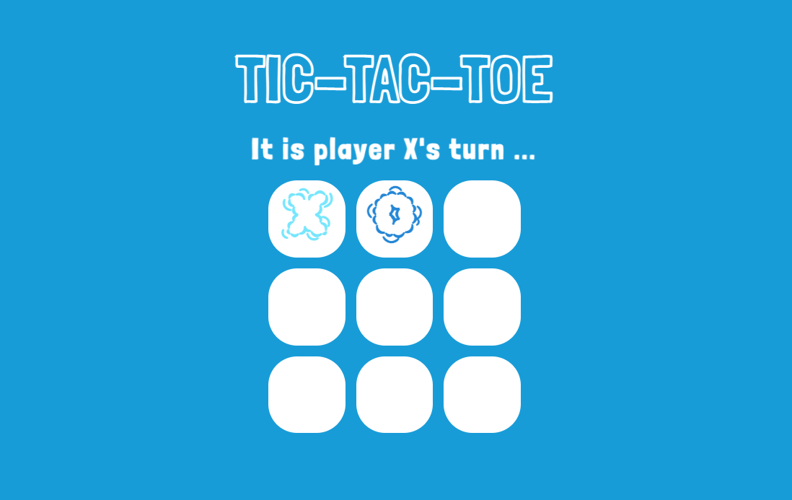
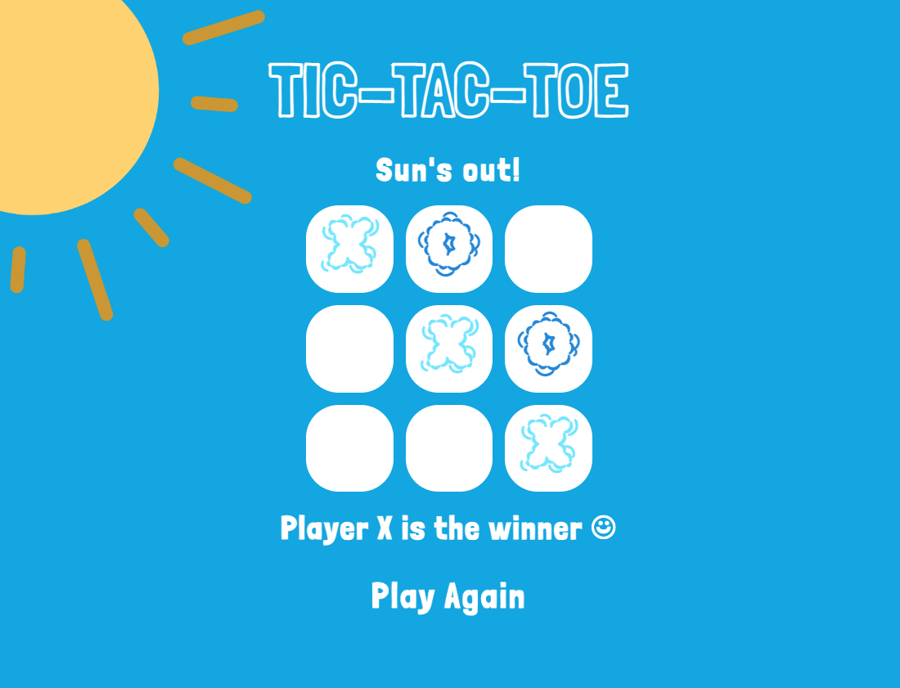
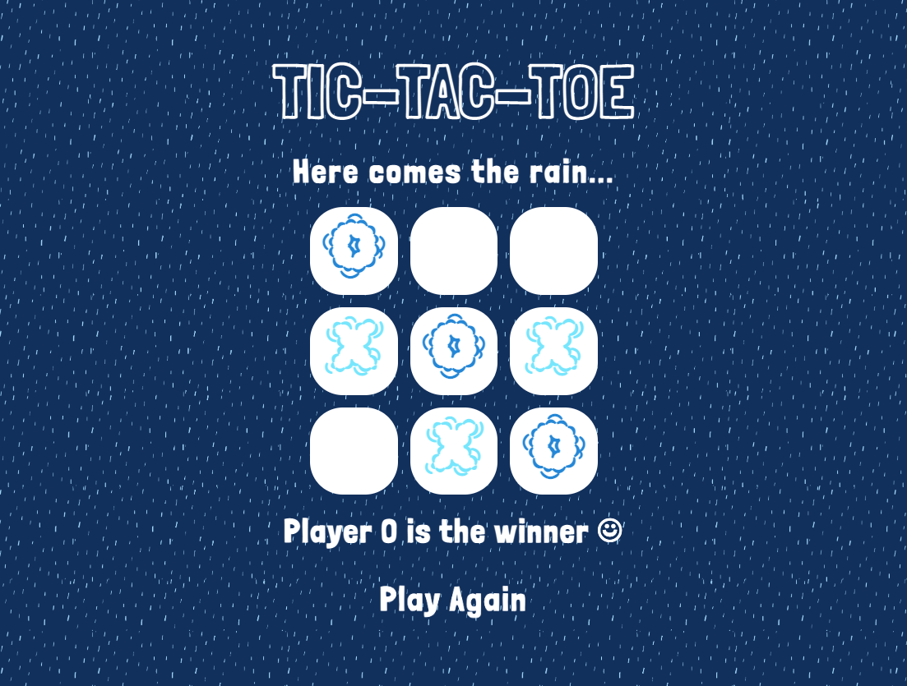

# TIC-TAC-TOE
Classic Tic-Tac-Toe with a bit of a story and a tiny twist. 

## Description of game 
Tic-Tac-Toe is a simple, two player game and the goal is to be the first player to get three in a row on a 3-by-3 grid. 
 
 
My version is weather themed. Melbourne, the city known to have four seasons in one day and being based there, that was my inspiration for this game. Depending on who wins, you'll either get to enjoy the great outdoors in the blazing sun or tuck yourself warmly in bed and fall asleep listening to the heavy downpour. Or...if nobody wins, it'll be another cloudy day. 
 
 

## Getting started 
**Link to the game:** https://wendyyzhu.github.io/tic-tac-toe/

### How to play: 
This is a two player game, pick which player you want to be: 
- Player X if you prefer sunny weather. The X marker represents a cloud that is ready to dissipate.  
- Player O if you're a rain lover. The O marker represents a cloud that is filled with water vapour that's ready to fall. 

The game is configured so that Player X starts and the game will let you know when it is Player O's turn. 

Each player takes turns picking a block until one player gets three in a row. If Player X wins, as promised, the sun comes out... 

If Player O wins, here comes the rain...

Once the game has finished, there will be the option to play again and the game will reset. 

### Technologies used: 
- HTML 
- CSS
- JavaScript 
